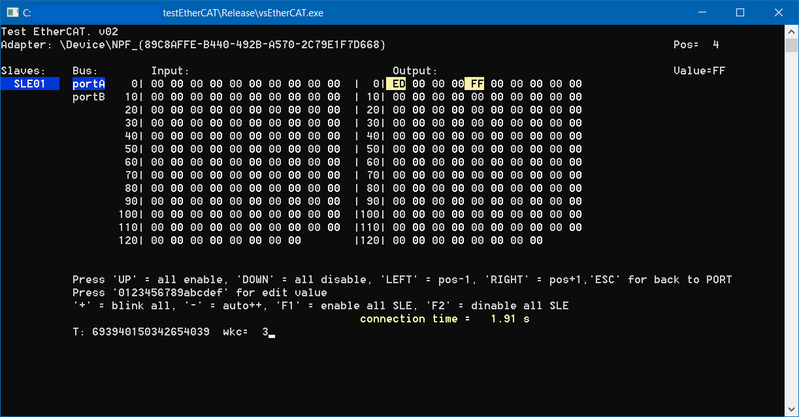

# Тестирование EtherCAT-контроллеров 
В моём случае есть контроллеры Ethercat (на мк Microchip LAN9252) с параметрами:
- Vendor 0x0B90
- Product 0x01, 0x03
- Name SLE01 и SLE03
- SLE01 = 128+128 uint8 как на input, так и output
- SLE03 = 128 uint8 + 64 uint32 на output, 128 uint8 на input
К контроллерам можно подключиться в TwinCAT или EtherCAT Explorer. 

**Задача:** сделать утилиту для проверки подключенных к EtherCAT-контроллерам датчиков посредством пары кнопок на экране или клавиатуре. Проверка заключается в выполнении "бегущей волны" простым перебором диапазона регистров с установкой им 255 и 0. Также нужны 4 кнопки "зажечь следующий", "зажечь предыдущий", "зажечь всех", "потушить всех" для зоны A, B и другие функции. 

## SOEM
Для решения задачи взята библиотека Simple Open EtherCAT Master Library (https://github.com/OpenEtherCATsociety/SOEM). 

Библиотека компилируется в набор *.lib-файлов, которые линкуются с приложением

Для работы с EtherCAT с надо также установить Npcap (https://nmap.org/npcap/). При установке должна стоять галочка **"WinPcap API-compatible mode"**

### Компиляция библиотеки SOEM
- Visual Studio 2019, git и CMake
- выполнить `git clone https://github.com/OpenEtherCATsociety/SOEM.git` в подходящую папку
- создать в этой же папке каталог `build` в который необходимо зайти из "x86 Native Tools Command Prompt for VS 2019". Нужна версия именно x86, т.к. библиотека собирается для 32-бит.
- `cmake .. -G "NMake Makefiles"` выполнится генерация make-файла на основе CMakeLists.txt из корневого каталога (если нужны примеры из test\win32, то надо их прописать и в нужных папках добавить соответствующий CMakeLists.txt)
- `nmake` всё скомпилируется MSVS компилятором. 

### Создание проекта

- Предполагается, что папка SOEM из предыдущего пункта находится в папке с проектом. Выбрана сборка "Release".
- В проекте для Win C++ в настроках надо добавить скомпилированные библиотеки и хидеры:
  - **C/C++ / General / Additional Include Directories** добавить `SOEM\soem;SOEM\osal;SOEM\osal\win32;SOEM\oshw\win32\wpcap\Include\pcap;SOEM\oshw\win32\wpcap\Include;SOEM\oshw\win32;`
  - **Linker / General / Additional Library Directories** добавить  `SOEM\build;SOEM\oshw\win32\wpcap\Lib;`
  - **Linker / General / Additional Dependencies** добавить в начало `soem.lib;Packet.lib;wpcap.lib;Ws2_32.lib;winmm.lib;msvcmrt.lib;msvcrt.lib;`. Последние 4 библиотеки не из SOEM, но они нужны.
  - **C/C++ / Code Generation / Runtime Library** выбирают `Multi-threaded (/MT)` для статической сборки
  - **Linker / General / Command Line / Additional Options** добавить  `/NODEFAULTLIB:LIBCMT /NODEFAULTLIB:MSVCRTD`. Так как компилируется статически для Release.
  
Первая версия - консольная, на основе примеров из SOEM. 

**КОМПИЛИРОВАТЬ СБОРКУ "x86 Release"**

### Windows XP
Для поддержки win xp требуется установить "v141_xp toolset" для vs2019.

Вместо Npcap следует установить WinPcap.

Для запуска приложения могут понадобится библиотеки vc_redist.x86.exe, например:   
Microsoft Visual C++ 2015 Redistributable (x86) - 14.0.23026. Объём около 11 Мегабайт.   
https://www.microsoft.com/ru-ru/download/confirmation.aspx?id=48145